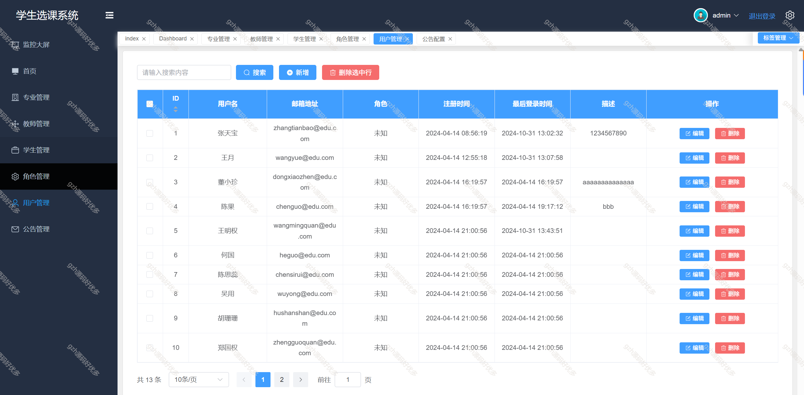

 
## 查看主页获取源码

### 一、关键词

选课管理系统、课程管理系统

 

### 二、作品包含

源码+数据库+万字文档+全套环境和工具资源+部署教程

 

### 三、项目技术

前端技术：Vue3 + pinia + Element Plus+Echarts+Axios
后端技术：Python3+Flask
  

 

### 四、运行环境（以下版本亲测，其他版本未知，请自测）

开发工具：PyCharm + VSCODE

数据库：MySQL8

数据库管理工具：Navicat10+

Python：Python3.8

前端Nodejs：18

浏览器：谷歌浏览器

 

### 五、项目介绍

项目编号：python027
  本论文旨在设计并实现一个高效、用户友好的高校学生选课管理系统。该系统针对当前高校选课过程中存在的信息不对称、操作繁琐及资源分配不均等问题，运用现代软件工程方法与数据库管理技术，构建了一个集课程信息查询、在线选课、课容量管理、学生选课数据分析等功能于一体的综合平台。此外，本研究还探讨了系统在实际应用中的性能评估与优化策略，确保系统能够有效应对高峰时段的访问压力，提升整体服务质量和学生满意度。综上所述，本论文所提出的高校学生选课管理系统不仅提高了选课效率与公平性，也为高校教育管理现代化提供了有力的技术支撑。

    用户登录、注销、密码找回
      登录采用双token设计，一个access_token，一个refresh_token
         首页Dashboard大屏数据统计
         学生专业管理
         教师管理
         课程开设      添加编辑删除学生成绩
         选课，包括：
         课程查询、选课
         已选课程查询、取消选课
         角色管理
         不同的角色赋予不同的权限，可做到按钮级别的权限
         用户管理
         不同的用户赋予不同的角色，展示不同的界面和操作权限
         审计管理
         三权分立，有单独的审计管理员，可以看到系统审计日志
         公告管理
         用户中心
         全局颜色方案修改

 

### 六、运行截图

